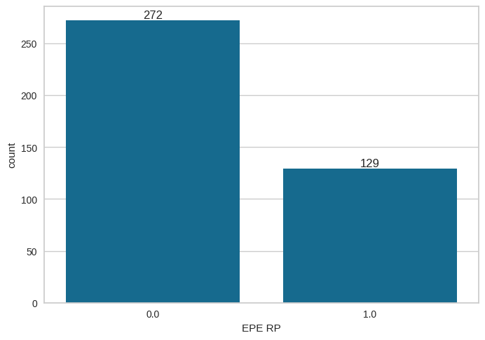
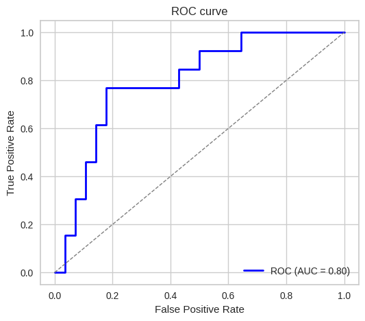
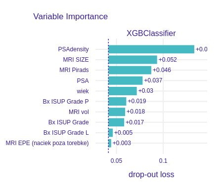
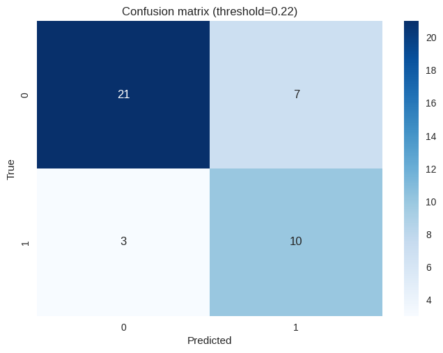
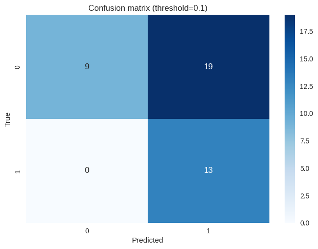
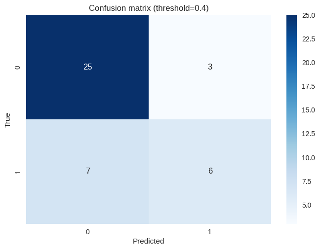

# Przewidywanie naciekania pozatorebkowego (EPE) na podstawie badania MRI i biopsji

## Dane
Wykorzystano dane z pliku `baza zanonimizowana UZUPEŁNIONA.xlsx`.

Użyte kolumny:
- `wiek`
- `PSA`
- `PSAdensity`
- `MRI vol`
- `MRI SIZE`
- `MRI Pirads`
- `MRI EPE`
- `MRI EPE L`
- `MRI EPE P`
- `MRI SVI`
- `MRI SVI L`
- `MRI SVI P`
- `Bx ISUP Grade P`
- `Bx ISUP Grade L`
- `Bx ISUP Grade`

Przewidywana kolumna: `EPE RP`

Testowany model: `XGBoost` (zoptymalizowany pod kątem brier score)

Stosunek negatywnych do pozytywnych przypadków naciekania pozatorebkowego EPE:

## Wyniki
**Krzywa ROC:**

**Najbardziej wartościowe kolumny dla modelu:**

**Metryki**

<table>
    <tr>
        <th colspan="3" style="text-align:center">Próg decyzji 0.22</th>
    </tr>
    <tr>
        <th style="text-align:center">Metryka</th>
        <th style="text-align:center">Wynik</th>
        <th style="text-align:center">Macierz błędów</th>
    </tr>
    </tr>
    <tr>
        <td>Sensitivity</td>
        <td>0.7692</td>
        <td rowspan="4">
            
        </td>
    </tr>
    <tr>
        <td>Specificity</td>
        <td>0.7500</td>
    </tr>
    <tr>
        <td>Accuracy</td>
        <td>0.7561</td>
    </tr>

</table>

<table>
    <tr>
        <th colspan="3" style="text-align:center">Próg decyzji 0.1</th>
    </tr>
    <tr>
        <th style="text-align:center">Metryka</th>
        <th style="text-align:center">Wynik</th>
        <th style="text-align:center">Macierz błędów</th>
    </tr>
    </tr>
    <tr>
        <td>Sensitivity</td>
        <td>1.0000</td>
        <td rowspan="4">
            
        </td>
    </tr>
    <tr>
        <td>Specificity</td>
        <td>0.3214</td>
    </tr>
    <tr>
        <td>Accuracy</td>
        <td>0.5366</td>
    </tr>

</table>

<table>
    <tr>
        <th colspan="3" style="text-align:center">Próg decyzji 0.4</th>
    </tr>
    <tr>
        <th style="text-align:center">Metryka</th>
        <th style="text-align:center">Wynik</th>
        <th style="text-align:center">Macierz błędów</th>
    </tr>
    </tr>
    <tr>
        <td>Sensitivity</td>
        <td>0.4615</td>
        <td rowspan="4">
            
        </td>
    </tr>
    <tr>
        <td>Specificity</td>
        <td>0.8929</td>
    </tr>
    <tr>
        <td>Accuracy</td>
        <td>0.7561</td>
    </tr>

</table>
