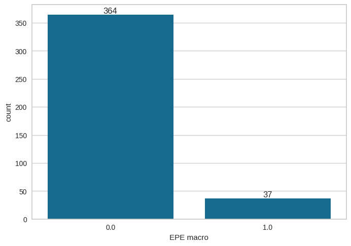
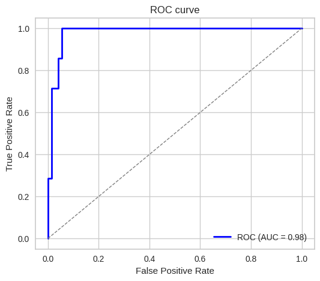
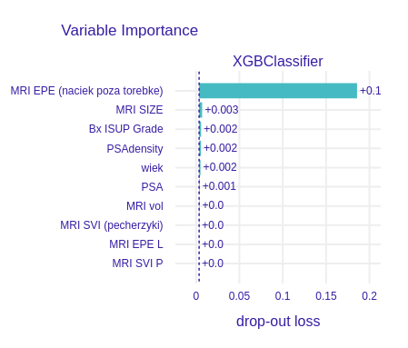
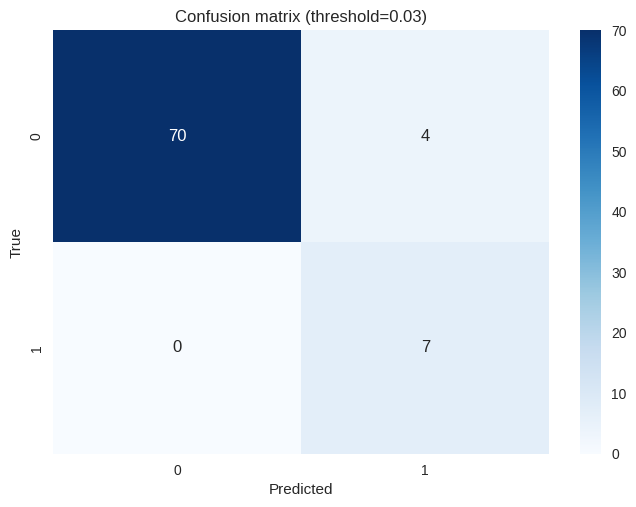
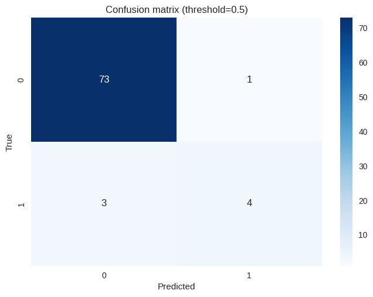

# Przewidywanie makroskopowego naciekania pozatorebkowego (Macroscopic EPE) na podstawie badania MRI i biopsji

## Dane
Wykorzystano dane z pliku `baza zanonimizowana UZUPEŁNIONA.xlsx`.

Użyte kolumny:
- `wiek`
- `PSA`
- `PSAdensity`
- `MRI vol`
- `MRI SIZE`
- `MRI Pirads`
- `MRI EPE`
- `MRI EPE L`
- `MRI EPE P`
- `MRI SVI`
- `MRI SVI L`
- `MRI SVI P`
- `Bx ISUP Grade P`
- `Bx ISUP Grade L`
- `Bx ISUP Grade`

Przewidywana kolumna: `EPE macro` (utworzona kolumna, która posiada wartość 1 jeśli `EPE RP` == 1 oraz `MRI EPE` == 1, w przeciwnym wypadku 0)

Testowany model: `XGBoost` (zoptymalizowany pod kątem brier score)

Stosunek negatywnych do pozytywnych przypadków naciekania makroskopowego:

## Wyniki
**Krzywa ROC:**

**Najbardziej wartościowe kolumny dla modelu:**

**Metryki**

<table>
    <tr>
        <th colspan="3" style="text-align:center">Próg decyzji 0.03</th>
    </tr>
    <tr>
        <th style="text-align:center">Metryka</th>
        <th style="text-align:center">Wynik</th>
        <th style="text-align:center">Macierz błędów</th>
    </tr>
    </tr>
    <tr>
        <td>Sensitivity</td>
        <td>1.0000</td>
        <td rowspan="4">
            
        </td>
    </tr>
    <tr>
        <td>Specificity</td>
        <td>0.9459</td>
    </tr>
    <tr>
        <td>Accuracy</td>
        <td>0.9506</td>
    </tr>

</table>

<table>
    <tr>
        <th colspan="3" style="text-align:center">Próg decyzji 0.5</th>
    </tr>
    <tr>
        <th style="text-align:center">Metryka</th>
        <th style="text-align:center">Wynik</th>
        <th style="text-align:center">Macierz błędów</th>
    </tr>
    </tr>
    <tr>
        <td>Sensitivity</td>
        <td>0.5714</td>
        <td rowspan="4">
            
        </td>
    </tr>
    <tr>
        <td>Specificity</td>
        <td>0.9865</td>
    </tr>
    <tr>
        <td>Accuracy</td>
        <td>0.9506</td>
    </tr>

</table>
