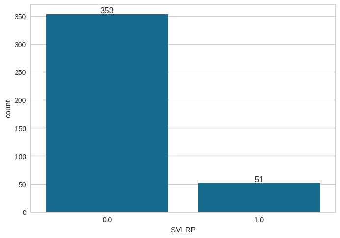
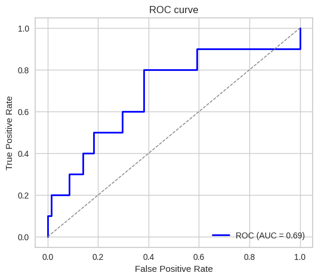
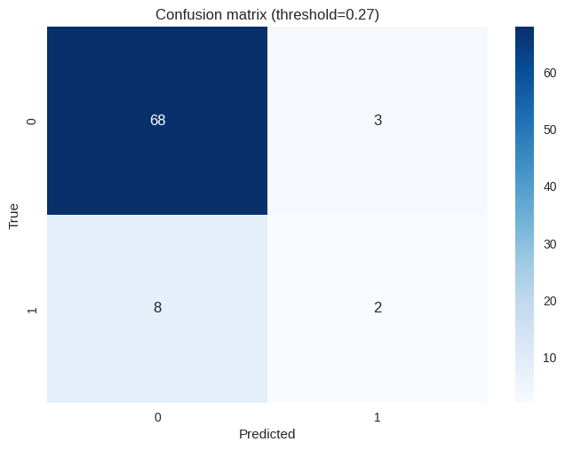
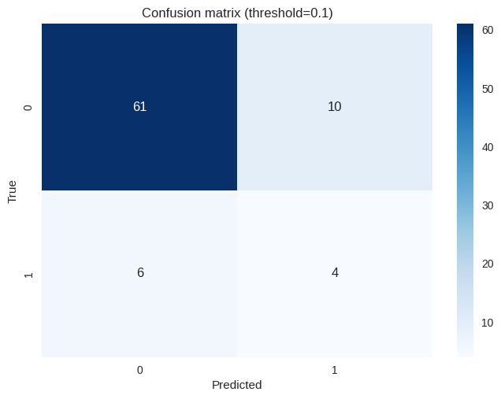
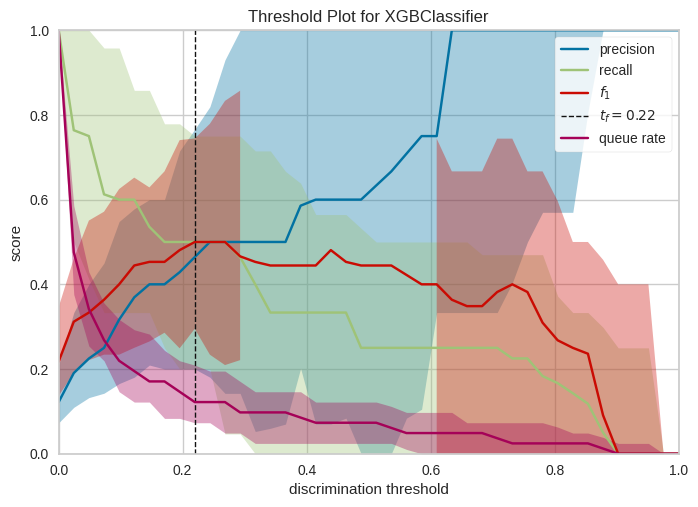

# Przewidywanie SVI RP na podstawie badania MRI i biopsji

## Dane
Wykorzystano dane z pliku `baza zanonimizowana UZUPEŁNIONA.xlsx`.

Użyte kolumny:
- `wiek`
- `PSA`
- `PSAdensity`
- `MRI vol`
- `MRI SIZE`
- `MRI Pirads`
- `MRI EPE`
- `MRI EPE L`
- `MRI EPE P`
- `MRI SVI`
- `MRI SVI L`
- `MRI SVI P`
- `Bx ISUP Grade P`
- `Bx ISUP Grade L`
- `Bx ISUP Grade`

Przewidywana kolumna: `SVI`

Testowany model: `XGBoost` (zoptymalizowany pod kątem AUC)

Stosuenk negatywnych do pozytywnych przypadków SVI:

## Wyniki
**Krzywa ROC:**

<table>
    <tr>
        <th colspan="3" style="text-align:center">Próg decyzji 0.27</th>
    </tr>
    <tr>
        <th style="text-align:center">Metryka</th>
        <th style="text-align:center">Wynik</th>
        <th style="text-align:center">Macierz błędów</th>
    </tr>
    </tr>
    <tr>
        <td>Sensitivity</td>
        <td>0.3000</td>
        <td rowspan="4">
            
        </td>
    </tr>
    <tr>
        <td>Specificity</td>
        <td>0.9296</td>
    </tr>
    <tr>
        <td>Accuracy</td>
        <td>0.8519</td>
    </tr>

</table>

<table>
    <tr>
        <th colspan="3" style="text-align:center">Próg decyzji 0.61</th>
    </tr>
    <tr>
        <th style="text-align:center">Metryka</th>
        <th style="text-align:center">Wynik</th>
        <th style="text-align:center">Macierz błędów</th>
    </tr>
    </tr>
    <tr>
        <td>Sensitivity</td>
        <td>0.2000</td>
        <td rowspan="4">
            
        </td>
    </tr>
    <tr>
        <td>Specificity</td>
        <td>0.9577</td>
    </tr>
    <tr>
        <td>Accuracy</td>
        <td>0.8642</td>
    </tr>

</table>

<table>
    <tr>
        <th colspan="3" style="text-align:center">Próg decyzji 0.1</th>
    </tr>
    <tr>
        <th style="text-align:center">Metryka</th>
        <th style="text-align:center">Wynik</th>
        <th style="text-align:center">Macierz błędów</th>
    </tr>
    </tr>
    <tr>
        <td>Sensitivity</td>
        <td>0.4000</td>
        <td rowspan="4">
            
        </td>
    </tr>
    <tr>
        <td>Specificity</td>
        <td>0.8592</td>
    </tr>
    <tr>
        <td>Accuracy</td>
        <td>0.8025</td>
    </tr>

</table>

## Feature inportances

