# Przewidywanie naciekania pozatorebkowego (EPE) na podstawie badania MRI i biopsji

## Dane
Wykorzystano dane z pliku `baza zanonimizowana UZUPEŁNIONA.xlsx`.

Użyte kolumny:
- `wiek`
- `PSA`
- `PSAdensity`
- `MRI vol`
- `MRI SIZE`
- `MRI Pirads`
- `MRI EPE`
- `MRI EPE L`
- `MRI EPE P`
- `MRI SVI`
- `MRI SVI L`
- `MRI SVI P`
- `Bx ISUP Grade P`
- `Bx ISUP Grade L`
- `Bx ISUP Grade`

Przewidywana kolumna: `EPE RP`

Testowany model: `XGBoost` (zoptymalizowany pod kątem brier score)

Stosunek negatywnych do pozytywnych przypadków naciekania pozatorebkowego EPE:

## Wyniki
**Krzywa ROC:**

**Najbardziej wartościowe kolumny dla modelu:**

**Metryki**

<table>
    <tr>
        <th colspan="3" style="text-align:center">Próg decyzji 0.22</th>
    </tr>
    <tr>
        <th style="text-align:center">Metryka</th>
        <th style="text-align:center">Wynik</th>
        <th style="text-align:center">Macierz błędów</th>
    </tr>
    </tr>
    <tr>
        <td>Sensitivity</td>
        <td>0.7692</td>
        <td rowspan="4">
            
        </td>
    </tr>
    <tr>
        <td>Specificity</td>
        <td>0.7500</td>
    </tr>
    <tr>
        <td>Accuracy</td>
        <td>0.7561</td>
    </tr>

</table>

<table>
    <tr>
        <th colspan="3" style="text-align:center">Próg decyzji 0.1</th>
    </tr>
    <tr>
        <th style="text-align:center">Metryka</th>
        <th style="text-align:center">Wynik</th>
        <th style="text-align:center">Macierz błędów</th>
    </tr>
    </tr>
    <tr>
        <td>Sensitivity</td>
        <td>1.0000</td>
        <td rowspan="4">
            
        </td>
    </tr>
    <tr>
        <td>Specificity</td>
        <td>0.3214</td>
    </tr>
    <tr>
        <td>Accuracy</td>
        <td>0.5366</td>
    </tr>

</table>

<table>
    <tr>
        <th colspan="3" style="text-align:center">Próg decyzji 0.4</th>
    </tr>
    <tr>
        <th style="text-align:center">Metryka</th>
        <th style="text-align:center">Wynik</th>
        <th style="text-align:center">Macierz błędów</th>
    </tr>
    </tr>
    <tr>
        <td>Sensitivity</td>
        <td>0.4615</td>
        <td rowspan="4">
            
        </td>
    </tr>
    <tr>
        <td>Specificity</td>
        <td>0.8929</td>
    </tr>
    <tr>
        <td>Accuracy</td>
        <td>0.7561</td>
    </tr>

</table>

# Przewidywanie makroskopowego naciekania pozatorebkowego (Macroscopic EPE) na podstawie badania MRI i biopsji

## Dane
Wykorzystano dane z pliku `baza zanonimizowana UZUPEŁNIONA.xlsx`.

Użyte kolumny:
- `wiek`
- `PSA`
- `PSAdensity`
- `MRI vol`
- `MRI SIZE`
- `MRI Pirads`
- `MRI EPE`
- `MRI EPE L`
- `MRI EPE P`
- `MRI SVI`
- `MRI SVI L`
- `MRI SVI P`
- `Bx ISUP Grade P`
- `Bx ISUP Grade L`
- `Bx ISUP Grade`

Przewidywana kolumna: `EPE macro` (utworzona kolumna, która posiada wartość 1 jeśli `EPE RP` == 1 oraz `MRI EPE` == 1, w przeciwnym wypadku 0)

Testowany model: `XGBoost` (zoptymalizowany pod kątem brier score)

Stosunek negatywnych do pozytywnych przypadków naciekania makroskopowego:

## Wyniki
**Krzywa ROC:**

**Najbardziej wartościowe kolumny dla modelu:**

**Metryki**

<table>
    <tr>
        <th colspan="3" style="text-align:center">Próg decyzji 0.03</th>
    </tr>
    <tr>
        <th style="text-align:center">Metryka</th>
        <th style="text-align:center">Wynik</th>
        <th style="text-align:center">Macierz błędów</th>
    </tr>
    </tr>
    <tr>
        <td>Sensitivity</td>
        <td>1.0000</td>
        <td rowspan="4">
            
        </td>
    </tr>
    <tr>
        <td>Specificity</td>
        <td>0.9459</td>
    </tr>
    <tr>
        <td>Accuracy</td>
        <td>0.9506</td>
    </tr>

</table>

<table>
    <tr>
        <th colspan="3" style="text-align:center">Próg decyzji 0.5</th>
    </tr>
    <tr>
        <th style="text-align:center">Metryka</th>
        <th style="text-align:center">Wynik</th>
        <th style="text-align:center">Macierz błędów</th>
    </tr>
    </tr>
    <tr>
        <td>Sensitivity</td>
        <td>0.5714</td>
        <td rowspan="4">
            
        </td>
    </tr>
    <tr>
        <td>Specificity</td>
        <td>0.9865</td>
    </tr>
    <tr>
        <td>Accuracy</td>
        <td>0.9506</td>
    </tr>

</table>

# Przewidywanie mikroskopowego naciekania pozatorebkowego (Microscopic EPE) na podstawie badania MRI i biopsji

## Dane
Wykorzystano dane z pliku `baza zanonimizowana UZUPEŁNIONA.xlsx`.

Użyte kolumny:
- `wiek`
- `PSA`
- `PSAdensity`
- `MRI vol`
- `MRI SIZE`
- `MRI Pirads`
- `MRI EPE`
- `MRI EPE L`
- `MRI EPE P`
- `MRI SVI`
- `MRI SVI L`
- `MRI SVI P`
- `Bx ISUP Grade P`
- `Bx ISUP Grade L`
- `Bx ISUP Grade`

Przewidywana kolumna: `EPE micro` (utworzona kolumna, która posiada wartość 1 jeśli `EPE RP` == 1 oraz `MRI EPE` == 0, w przeciwnym wypadku 0)

<!-- reduced_df['EPE micro'] = (((reduced_df['EPE RP'] == 1) & (reduced_df['MRI EPE (naciek poza torebke)'] == 0))).astype(float)
reduced_df['EPE macro'] = (((reduced_df['EPE RP'] == 1) & (reduced_df['MRI EPE (naciek poza torebke)'] == 1))).astype(float) -->

Testowany model: `XGBoost` (zoptymalizowany pod kątem brier score)

Stosuenk negatywnych do pozytywnych przypadków naciekania mikroskopowego:

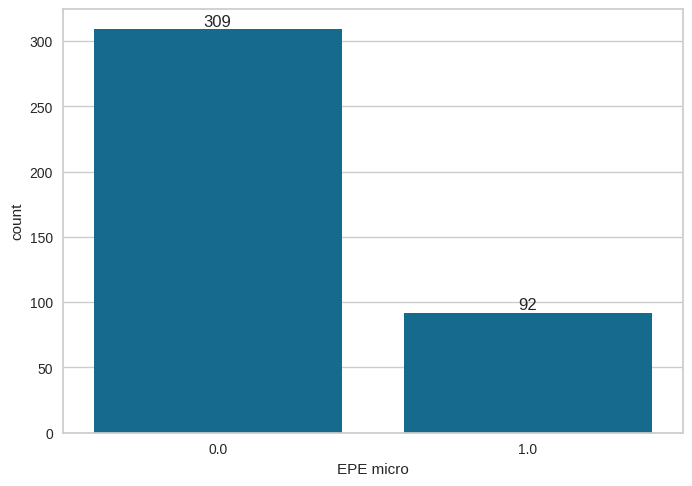

## Wyniki
**Krzywa ROC:**

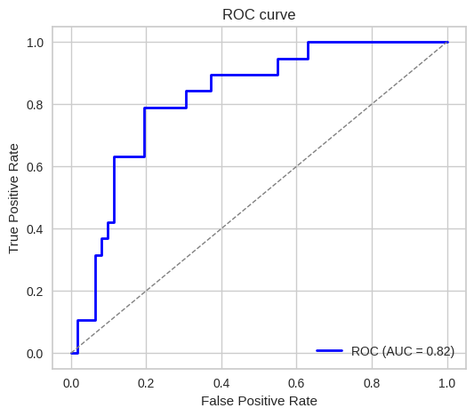

**Najbardziej wartościowe kolumny dla modelu:**

**Metryki**

<table>
    <tr>
        <th colspan="3" style="text-align:center">Próg decyzji 0.15</th>
    </tr>
    <tr>
        <th style="text-align:center">Metryka</th>
        <th style="text-align:center">Wynik</th>
        <th style="text-align:center">Macierz błędów</th>
    </tr>
    </tr>
    <tr>
        <td>Sensitivity</td>
        <td>0.8947</td>
        <td rowspan="4">
            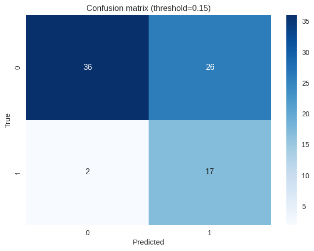
        </td>
    </tr>
    <tr>
        <td>Specificity</td>
        <td>0.5806</td>
    </tr>
    <tr>
        <td>Accuracy</td>
        <td>0.6543</td>
    </tr>

</table>

<table>
    <tr>
        <th colspan="3" style="text-align:center">Próg decyzji 0.35</th>
    </tr>
    <tr>
        <th style="text-align:center">Metryka</th>
        <th style="text-align:center">Wynik</th>
        <th style="text-align:center">Macierz błędów</th>
    </tr>
    </tr>
    <tr>
        <td>Sensitivity</td>
        <td>0.6316</td>
        <td rowspan="4">
            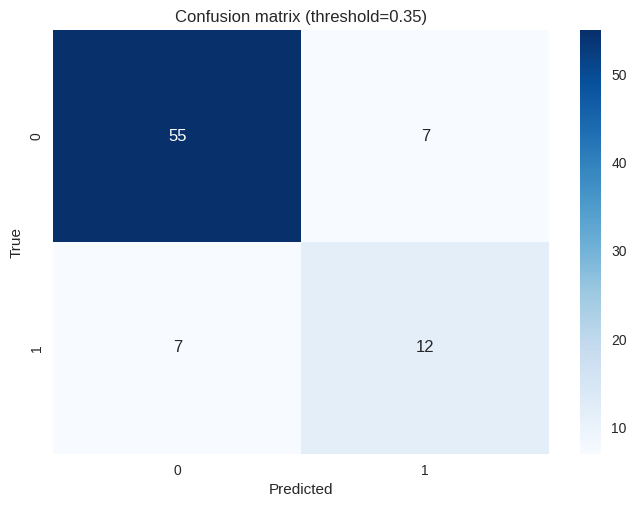
        </td>
    </tr>
    <tr>
        <td>Specificity</td>
        <td>0.8871</td>
    </tr>
    <tr>
        <td>Accuracy</td>
        <td>0.8272</td>
    </tr>

</table>

# Przewidywanie naciekania na węzły chłonne na podstawie badania MRI i biopsji

## Dane
Wykorzystano dane z pliku `baza zanonimizowana UZUPEŁNIONA.xlsx`.

Użyte kolumny:
- `wiek`
- `PSA`
- `PSAdensity`
- `MRI vol`
- `MRI SIZE`
- `MRI Pirads`
- `MRI EPE`
- `MRI EPE L`
- `MRI EPE P`
- `MRI SVI`
- `MRI SVI L`
- `MRI SVI P`
- `Bx ISUP Grade P`
- `Bx ISUP Grade L`
- `Bx ISUP Grade`

Przewidywana kolumna: `N+`

Testowany model: `XGBoost` (zoptymalizowany pod kątem AUC)

Stosuenk negatywnych do pozytywnych przypadków naciekania na węzły chłonne:

## Wyniki
**Krzywa ROC:**

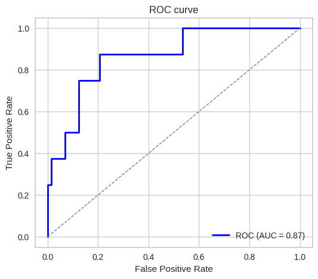

**Macierz błędów:**

<table>
    <tr>
        <th style="text-align:center">Metryka</th>
        <th style="text-align:center">Wynik</th>
        <th style="text-align:center">Macierz błędów</th>
    </tr>
    </tr>
    <tr>
        <td>AUC</td>
        <td>0.853</td>
        <td rowspan="4">
            
        </td>
    </tr>
    <tr>
        <td>Sensitivity</td>
        <td>0.3750</td>
    </tr>
    <tr>
        <td>Specificity</td>
        <td>0.9726</td>
    </tr>
    <tr>
        <td>Accuracy</td>
        <td>0.9136</td>
    </tr>

</table>

--- 

Otrzymane AUC jest wysokie.

Wysoka ilość FN - model nie wykrywa niektórych przydapków pozytywnych.

Zmieniając próg decyzji możemy sterować tą wielkością kosztem zwiększenia FP, zwiększymy sensitivity ale spadnie zarówno accuracy jak i specificity.

<table>
    <tr>
        <th colspan="3" style="text-align:center">Próg decyzji 0.1</th>
    </tr>
    <tr>
        <th style="text-align:center">Metryka</th>
        <th style="text-align:center">Wynik</th>
        <th style="text-align:center">Macierz błędów</th>
    </tr>
    </tr>
    <tr>
        <td>Sensitivity</td>
        <td>0.5000</td>
        <td rowspan="4">
            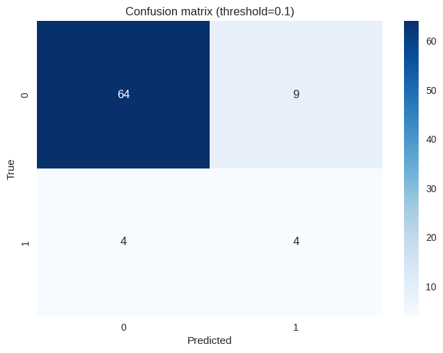
        </td>
    </tr>
    <tr>
        <td>Specificity</td>
        <td>0.8767</td>
    </tr>
    <tr>
        <td>Accuracy</td>
        <td>0.8395</td>
    </tr>

</table>

<table>
    <tr>
        <th colspan="3" style="text-align:center">Próg decyzji 0.074</th>
    </tr>
    <tr>
        <th style="text-align:center">Metryka</th>
        <th style="text-align:center">Wynik</th>
        <th style="text-align:center">Macierz błędów</th>
    </tr>
    </tr>
    <tr>
        <td>Sensitivity</td>
        <td>0.8750</td>
        <td rowspan="4">
            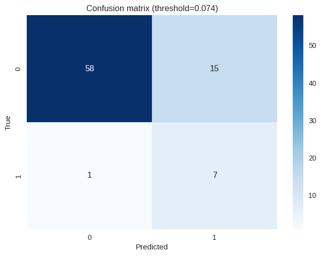
        </td>
    </tr>
    <tr>
        <td>Specificity</td>
        <td>0.7945</td>
    </tr>
    <tr>
        <td>Accuracy</td>
        <td>0.8025</td>
    </tr>

</table>

## Najwzażniejsze kolumny wskazane przez model
1. `Bx ISUP Grade`
2. `PSA`
3. `MRI EPE P`
4. `MRI SVI`

**Wpływ poszczególnych kolumn na ostateczny wynik**

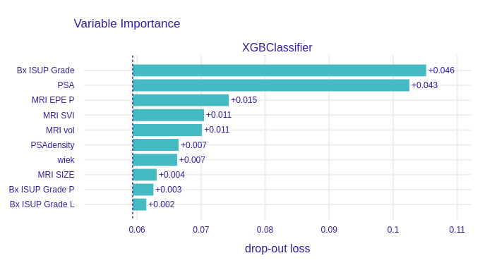

# Przewidywanie SVI RP na podstawie badania MRI i biopsji

## Dane
Wykorzystano dane z pliku `baza zanonimizowana UZUPEŁNIONA.xlsx`.

Użyte kolumny:
- `wiek`
- `PSA`
- `PSAdensity`
- `MRI vol`
- `MRI SIZE`
- `MRI Pirads`
- `MRI EPE`
- `MRI EPE L`
- `MRI EPE P`
- `MRI SVI`
- `MRI SVI L`
- `MRI SVI P`
- `Bx ISUP Grade P`
- `Bx ISUP Grade L`
- `Bx ISUP Grade`

Przewidywana kolumna: `SVI`

Testowany model: `XGBoost` (zoptymalizowany pod kątem AUC)

Stosuenk negatywnych do pozytywnych przypadków SVI:

## Wyniki
**Krzywa ROC:**

<table>
    <tr>
        <th colspan="3" style="text-align:center">Próg decyzji 0.27</th>
    </tr>
    <tr>
        <th style="text-align:center">Metryka</th>
        <th style="text-align:center">Wynik</th>
        <th style="text-align:center">Macierz błędów</th>
    </tr>
    </tr>
    <tr>
        <td>Sensitivity</td>
        <td>0.3000</td>
        <td rowspan="4">
            
        </td>
    </tr>
    <tr>
        <td>Specificity</td>
        <td>0.9296</td>
    </tr>
    <tr>
        <td>Accuracy</td>
        <td>0.8519</td>
    </tr>

</table>

<table>
    <tr>
        <th colspan="3" style="text-align:center">Próg decyzji 0.61</th>
    </tr>
    <tr>
        <th style="text-align:center">Metryka</th>
        <th style="text-align:center">Wynik</th>
        <th style="text-align:center">Macierz błędów</th>
    </tr>
    </tr>
    <tr>
        <td>Sensitivity</td>
        <td>0.2000</td>
        <td rowspan="4">
            
        </td>
    </tr>
    <tr>
        <td>Specificity</td>
        <td>0.9577</td>
    </tr>
    <tr>
        <td>Accuracy</td>
        <td>0.8642</td>
    </tr>

</table>

<table>
    <tr>
        <th colspan="3" style="text-align:center">Próg decyzji 0.1</th>
    </tr>
    <tr>
        <th style="text-align:center">Metryka</th>
        <th style="text-align:center">Wynik</th>
        <th style="text-align:center">Macierz błędów</th>
    </tr>
    </tr>
    <tr>
        <td>Sensitivity</td>
        <td>0.4000</td>
        <td rowspan="4">
            
        </td>
    </tr>
    <tr>
        <td>Specificity</td>
        <td>0.8592</td>
    </tr>
    <tr>
        <td>Accuracy</td>
        <td>0.8025</td>
    </tr>

</table>

## Feature inportances

# Przewidywanie naciekania pozatorebkowego na podstawie badania MRI (w późniejszym etapie dodatkowo gdzie celować biopsję).

## Dane
Wykorzystano dane z pliku `baza zanonimizowana UZUPEŁNIONA.xlsx`.

Użyte kolumny:
- `wiek`
- `PSA`
- `MRI vol`
- `MRI SIZE`
- `MRI Pirads`
- `MRI EPE (naciek poza torebke)`
- `MRI SVI (pęcherzyki)`
- `Bx ISUP Grade` (do wcześniejszej analizy, nie modelu)

Przewidywana kolumna: `EPE RP`

Testowany model: `XGBoost` (zoptymalizowany pod kątem AUC)

Stosunek negatywnych do pozytywnych przypadków naciekania pozatorebkowego:

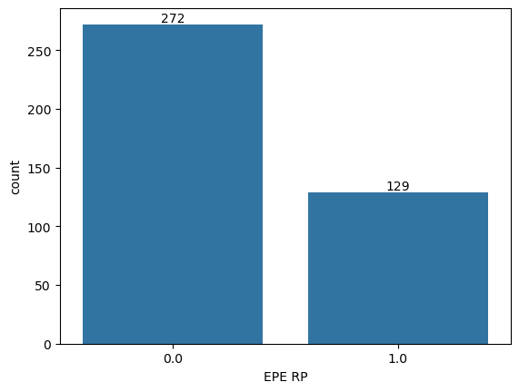

## Wyniki
**Krzywa ROC:**

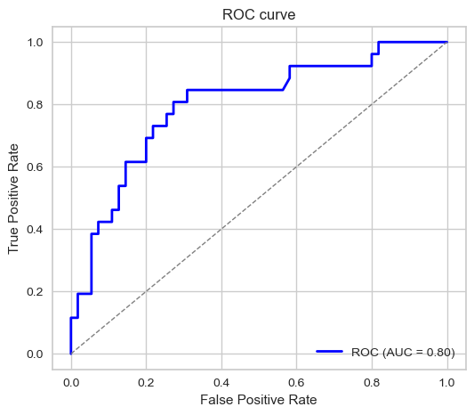

**Macierz błędów:**

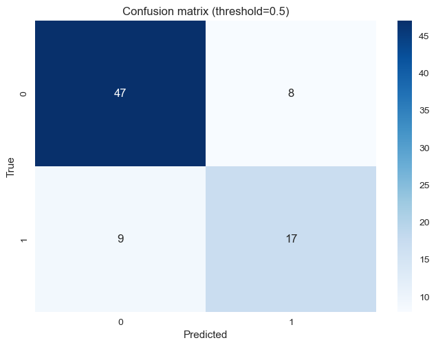

**Metryki**
Metryka | wynik
:---|:---
AUC | 0.80
Sensitivity | 0.6538
Specificity | 0.80
Accuracy | 0.7531

Otrzymane AUC jest w porządku.

Zmieniając próg decyzji możemy sterować tą wielkością kosztem zwiększenia FP, zwiększymy sensitivity ale spadnie zarówno accuracy jak i specificity.

<!-- <table>
    <tr>
        <th colspan="3" style="text-align:center">Próg decyzji 0.1</th>
    </tr>
    <tr>
        <th style="text-align:center">Metryka</th>
        <th style="text-align:center">Wynik</th>
        <th style="text-align:center">Macierz błędów</th>
    </tr>
    </tr>
    <tr>
        <td>Sensitivity</td>
        <td>0.5000</td>
        <td rowspan="4">
            
        </td>
    </tr>
    <tr>
        <td>Specificity</td>
        <td>0.8767</td>
    </tr>
    <tr>
        <td>Accuracy</td>
        <td>0.8395</td>
    </tr>

</table>

<table>
    <tr>
        <th colspan="3" style="text-align:center">Próg decyzji 0.074</th>
    </tr>
    <tr>
        <th style="text-align:center">Metryka</th>
        <th style="text-align:center">Wynik</th>
        <th style="text-align:center">Macierz błędów</th>
    </tr>
    </tr>
    <tr>
        <td>Sensitivity</td>
        <td>0.8750</td>
        <td rowspan="4">
            
        </td>
    </tr>
    <tr>
        <td>Specificity</td>
        <td>0.7945</td>
    </tr>
    <tr>
        <td>Accuracy</td>
        <td>0.8025</td>
    </tr>

</table> -->