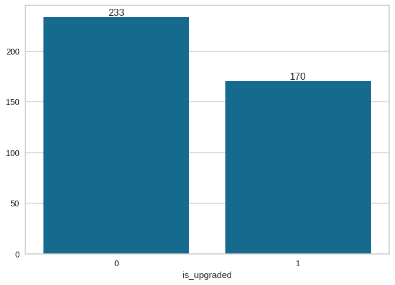
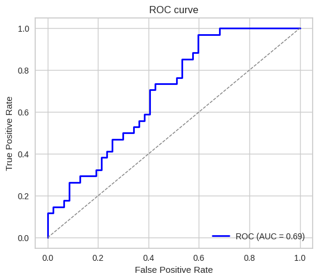
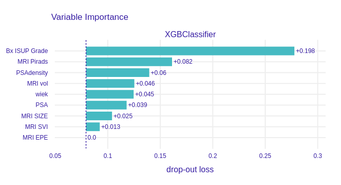
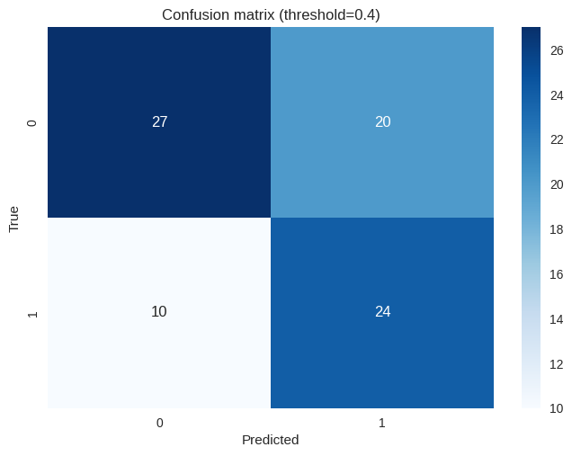
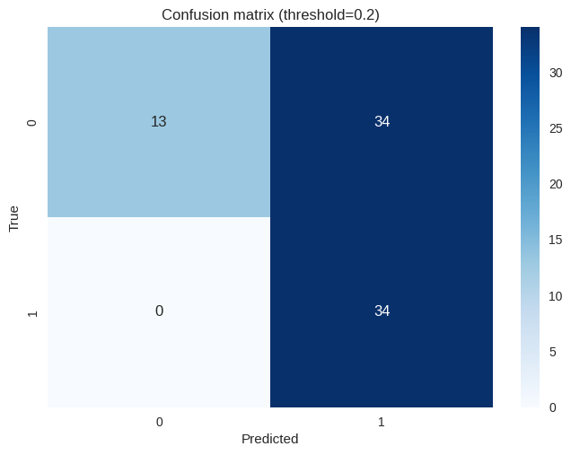
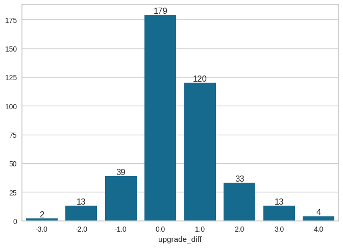

# Przewidywanie zmiany ISUP Grade z biopsji do ISUP Grade po prostatektomii (upgrading)

### Upgrading podzieliliśmy na dwie wersje: binarną oraz regresję, gdzie odpowiednio przewidujemy czy upgrade zaszedł oraz o ile wystąpił upgrade lub downgrade.

# Binarny upgrading

## Dane
Wykorzystano dane z pliku `baza zanonimizowana UZUPEŁNIONA.xlsx`.

Użyte kolumny:
- `wiek`
- `PSA`
- `PSAdensity`
- `MRI vol`
- `MRI SIZE`
- `MRI Pirads`
- `MRI EPE`
- `MRI SVI`
- `Bx ISUP Grade`

Przewidywana kolumna: `is_upgraded` (wartość 1, jeśli ISUP Grade po prostatektomii jest wyższy niż ISUP Grade z biopsji, w przeciwnym razie 0 (jeżeli zaszedł downgrade również wartość 0))

Testowany model: `XGBoost` (zoptymalizowany pod kątem brier score)

Rozkład pacjentów z upgradem vs. bez upgradu:

## Wyniki
**Krzywa ROC:**

**Najbardziej wartościowe kolumny dla modelu:**

<table>
    <tr>
        <th colspan="3" style="text-align:center">Próg decyzji 0.4</th>
    </tr>
    <tr>
        <th style="text-align:center">Metryka</th>
        <th style="text-align:center">Wynik</th>
        <th style="text-align:center">Macierz błędów</th>
    </tr>
    </tr>
    <tr>
        <td>Sensitivity</td>
        <td>0.7059</td>
        <td rowspan="4">
            
        </td>
    </tr>
    <tr>
        <td>Specificity</td>
        <td>0.5745</td>
    </tr>
    <tr>
        <td>Accuracy</td>
        <td>0.6296</td>
    </tr>

</table>

<table>
    <tr>
        <th colspan="3" style="text-align:center">Próg decyzji 0.2</th>
    </tr>
    <tr>
        <th style="text-align:center">Metryka</th>
        <th style="text-align:center">Wynik</th>
        <th style="text-align:center">Macierz błędów</th>
    </tr>
    </tr>
    <tr>
        <td>Sensitivity</td>
        <td>1.0000</td>
        <td rowspan="4">
            
        </td>
    </tr>
    <tr>
        <td>Specificity</td>
        <td>0.2766</td>
    </tr>
    <tr>
        <td>Accuracy</td>
        <td>0.5802</td>
    </tr>

</table>

# Upgrading regresja

## Dane
Wykorzystano dane z pliku `baza zanonimizowana UZUPEŁNIONA.xlsx`.

Użyte kolumny:
- `wiek`
- `PSA`
- `PSAdensity`
- `MRI vol`
- `MRI SIZE`
- `MRI Pirads`
- `MRI EPE`
- `MRI SVI`
- `Bx ISUP Grade`

Przewidywana kolumna: `upgrade_diff` (różnica między ISUP Grade po prostatektomii a ISUP Grade z biopsji, wartość dodatnia oznacza upgrade, ujemna downgrade, 0 brak zmiany)

Testowany model: `XGBoost`

Rozkład pacjentów względem różnicy ISUP Grade:

## Przykładowe predykcje modelu

|   True Values |   Predicted Values |
|--------------:|-------------------:|
|             1 |          1.13782   |
|            -1 |         -0.144731  |
|             1 |          0.669611  |
|             0 |          0.0090763 |
|             1 |          1.20638   |
|             2 |          1.41973   |
|             0 |          0.687312  |
|             0 |          0.0381611 |
|             0 |          0.529309  |
|             0 |          0.938786  |

## Wyniki

<table>
    <tr>
        <th colspan="3" style="text-align:center"></th>
    </tr>
    <tr>
        <th style="text-align:center">Metryka</th>
        <th style="text-align:center">Wynik</th>
    </tr>
    </tr>
    <tr>
        <td>RMSE (Root Mean Squared Error)</td>
        <td>0.9059</td>
    </tr>
    <tr>
        <td>MAE (Mean Absolute Error)</td>
        <td>0.7033</td>
    </tr>
    <tr>
        <td>R2 (Coefficient of Determination)</td>
        <td>0.2929</td>
    </tr>

</table>

